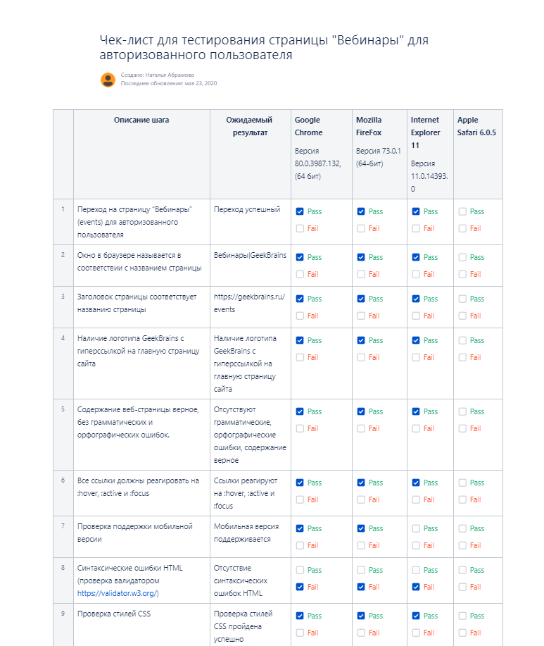

# Чек-лист для тестирования страницы "Вебинары" для авторизованного пользователя

1.	Переход на страницу “Вебинары” (events) для авторизованного пользователя

2. Окно в браузере называется в соответствии с названием страницы Вебинары|GeekBrains

3.	Заголовок страницы соответствует названию страницы https://geekbrains.ru/events

4.	Наличие логотипа GeekBrains с гиперссылкой на главную страницу сайта

5.	Содержание веб-страницы верное, без грамматических и орфографических ошибок.

6. Все ссылки должны реагировать на :hover, :active и :focus

7.	Проверка поддержки мобильной версии

8.	Синтаксические ошибки HTML (проверка валидатором https://validator.w3.org/)

9.	Проверка стилей CSS

10.	Соответствие макету

