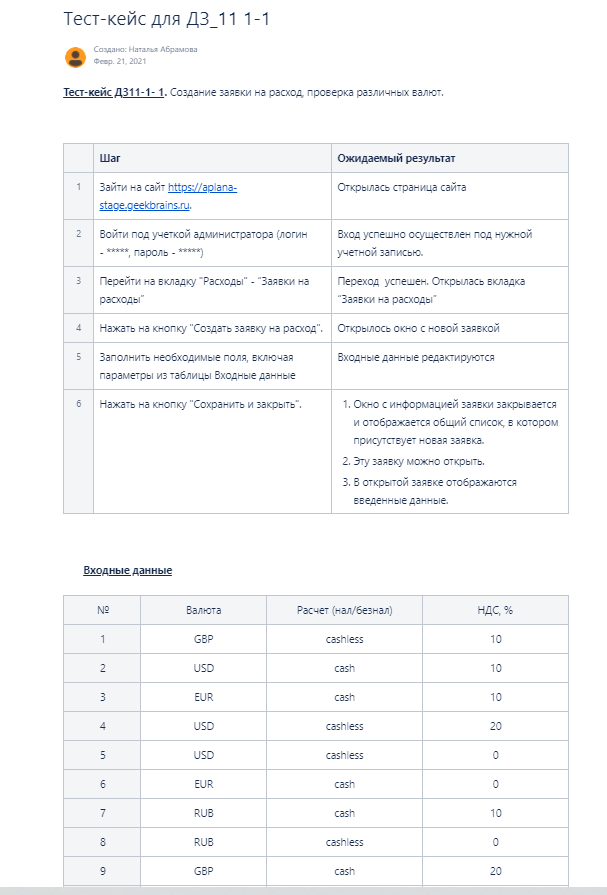

# Тест-кейс ДЗ11-1- 1. Создание заявки на расход, проверка различных валют.

         Шаг                                                -                   Ожидаемый результат

1. Зайти на сайт https://aplana-stage.geekbrains.ru.              -            Открылась страница сайта

2. Войти под учеткой администратора (логин - *****, пароль - *****)    -       Вход успешно осуществлен под нужной учетной записью.

3. Перейти на вкладку "Расходы" - “Заявки на расходы”                     -    Переход  успешен. Открылась вкладка “Заявки на расходы”

4. Нажать на кнопку "Создать заявку на расход".                             -  Открылось окно с новой заявкой

5. Заполнить необходимые поля, включая параметры из таблицы Входные данные  -  Входные данные редактируются

6. Нажать на кнопку "Сохранить и закрыть".                                  -   1. Окно с информацией заявки закрывается и отображается
                                                                                общий список, в котором присутствует новая заявка.
                                                                           -   2. Эту заявку можно открыть.
                                                                           -   3. В открытой заявке отображаются введенные данные.
                                                                                                                                                         -   

                                                                            

Входные данные

№           Валюта              Расчет (нал/безнал)             НДС, %

1           GBP                 cashless                        10

2           USD                 cash                            10

3           EUR                 cash                            10

4           USD                 cashless                        20

5           USD                 cashless                        0

6           EUR                 cash                            0

7           RUB                 cash                            10

8           RUB                 сashless                        0

9           GBP                 cash                            20

10          RUB                 cashless                        20

11          GBP                 cash                            0

12          EUR                 cashless                        20

